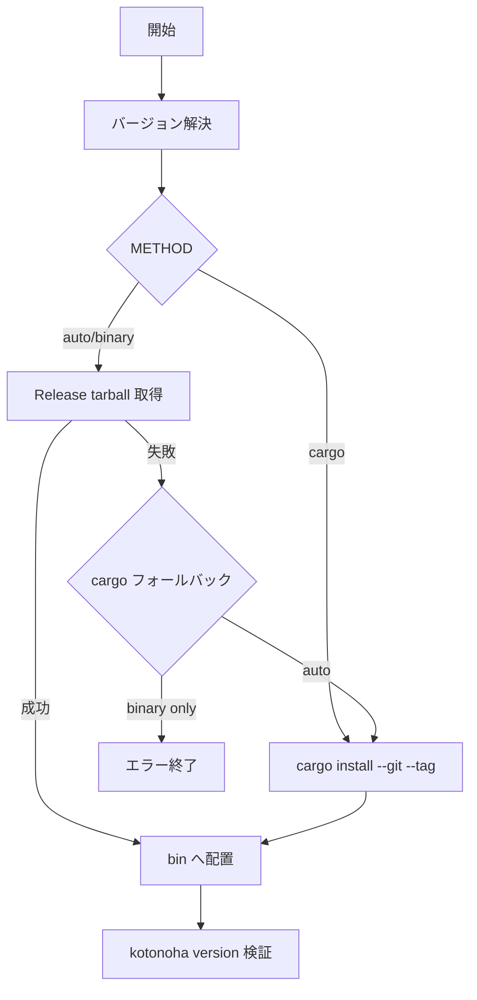

# Kotonoha CLI インストーラー — 実装手順書（メンテナ向け）

**Status:** informative（非規範）  
**対象:** `kotonoha-cli` の `scripts/install.sh` と GitHub Releases 資産  
**関連 Issue:** [kotonoha-cli#34](https://github.com/zyx-corporation/kotonoha-cli/issues/34), [kotonoha-docs#48](https://github.com/zyx-corporation/kotonoha-docs/issues/48)

## 1. 目的

初学者が Rust ツールチェーンを用意しなくても `kotonoha` CLI を導入できるようにする。公開面は次の2つです。

| 経路 | 利用者向け |
| --- | --- |
| `curl \| bash` | [install_kotonoha_cli.md](../tutorials/install_kotonoha_cli.md) |
| ソースビルド | [kotonoha-cli README](https://github.com/zyx-corporation/kotonoha-cli/blob/main/README_ja.md) |

## 2. 構成

| ファイル | 役割 |
| --- | --- |
| `kotonoha-cli/scripts/install.sh` | インストール本体（raw URL で配布） |
| `kotonoha-cli/.github/workflows/release.yml` | タグ `v*` push 時に tarball を Release へ添付 |

### 2.1 バイナリ命名規則

```
kotonoha-<TAG>-<PLATFORM>.tar.gz
```

- `<TAG>`: 例 `v0.2.9`（`Cargo.toml` のバージョンと一致させる）
- `<PLATFORM>`: `linux-amd64` | `macos-arm64`（将来 `linux-arm64` 等を追加可）
- アーカイブ直下に実行ファイル `kotonoha` を1つ置く

### 2.2 インストール先

| 変数 | 既定 | 説明 |
| --- | --- | --- |
| `KOTONOHA_INSTALL_DIR` | `$HOME/.local` | プレフィックス |
| （生成） | `$INSTALL_DIR/bin/kotonoha` | PATH に追加するディレクトリ |

## 3. インストールフロー（`install.sh`）



| 段階 | 動作 |
| --- | --- |
| バージョン | `KOTONOHA_VERSION` 未設定時は GitHub API で latest tag |
| binary | `releases/download/<tag>/kotonoha-<tag>-<platform>.tar.gz` |
| cargo | `cargo install kotonoha-cli --git ... --tag <tag> --root $INSTALL_DIR` |
| 検証 | `kotonoha version` が exit 0 |

環境変数 `KOTONOHA_INSTALL_METHOD`:

| 値 | 意味 |
| --- | --- |
| `auto`（既定） | binary → 失敗時 cargo |
| `binary` | tarball のみ（失敗で終了） |
| `cargo` | 常に cargo install |

## 4. リリース手順（メンテナ）

1. `Cargo.toml` の `version` を更新し `CHANGELOG.md` を追記
2. `main` にマージ
3. タグを作成して push（例: `git tag v0.2.9 && git push origin v0.2.9`）
4. **Release** ワークフローが完了するまで待つ（`linux-amd64` / `macos-arm64` 資産）
5. 利用者向けコマンドで smoke 確認:

```bash
curl -fsSL https://raw.githubusercontent.com/zyx-corporation/kotonoha-cli/main/scripts/install.sh | bash -s -- --version v0.2.9 --method binary
export PATH="$HOME/.local/bin:$PATH"
kotonoha version
```

6. 新タグの資産が未公開の間は、`--method cargo` または `KOTONOHA_INSTALL_METHOD=cargo` をドキュメントに明記

## 5. ドキュメント更新チェックリスト

- [ ] `kotonoha-docs/ja/tutorials/install_kotonoha_cli.md`（利用者）
- [ ] `ja/tutorials/README.md`（学習順序）
- [ ] `ja/tutorials/first_cli_session.md`（ビルド前提の削除）
- [ ] `ja/tutorials/slm_demo_quickstart.md`（インストール節の参照）
- [ ] `kotonoha-cli/README_ja.md`（Quickstart に curl 行を追加）

## 6. RDE 監査記録（本変更）

| ID | 設計意図 | 実装での扱い | σ（暫定） |
| --- | --- | --- | --- |
| I1 | 初学者の導入障壁を下げる | curl+bash + 既定 `$HOME/.local` | 正 |
| I2 | 規範契約は cli-definition のまま | インストールは配布経路のみ変更 | 正 |
| I3 | リリース未整備期間も動かす | binary 失敗時 cargo フォールバック | 正（不確実性は文書化） |
| A1 | PATH 未設定で「動かない」 | 終了時に PATH ヒントを表示 | 要レビュー（利用者が profile 編集） |

**human_review_needed:** PATH 案内の十分さ、cargo フォールバック時の Rust 前提の明示（チュートリアル側で補足済み）。

**resonance（同時充足）:** semantic_alignment ✓ / uncertainty_calibration ✓（フォールバック明記） / value_coordination ✓ / repairability ✓
