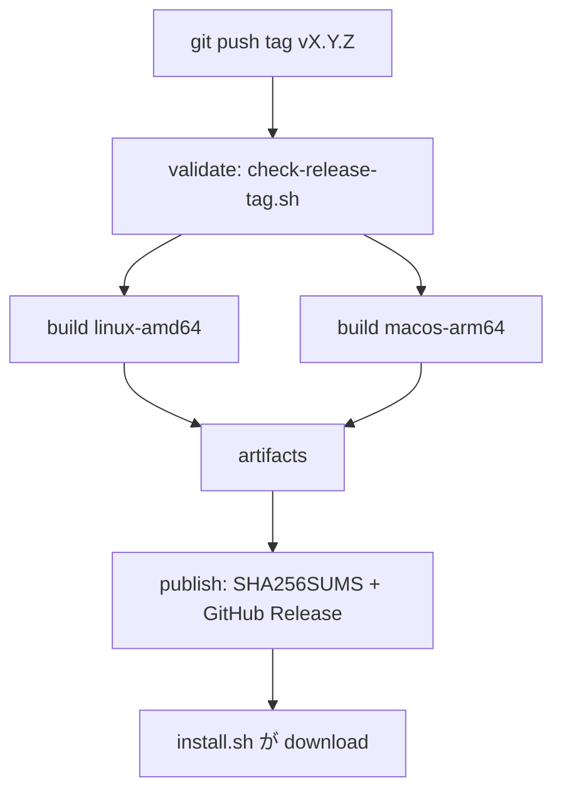

# Kotonoha CLI インストーラー — 実装手順書（メンテナ向け）

**Status:** informative（非規範）  
**対象:** `kotonoha-cli` の `scripts/install.sh` と GitHub Releases 資産  
**関連 Issue:** [kotonoha-cli#34](https://github.com/zyx-corporation/kotonoha-cli/issues/34), [kotonoha-docs#48](https://github.com/zyx-corporation/kotonoha-docs/issues/48)

## 1. 目的

初学者が Rust ツールチェーンを用意しなくても `kotonoha` CLI を導入できるようにする。公開面は次の2つです。

| 経路 | 利用者向け |
| --- | --- |
| `curl \| bash` | [install_kotonoha_cli.md](../tutorials/install_kotonoha_cli.md) |
| ソースビルド | [kotonoha-cli README](https://github.com/zyx-corporation/kotonoha-cli/blob/main/README_ja.md) |

**原則:** バイナリは **Git リポジトリに含めない**。配布は GitHub Releases のみ。

## 2. 構成

| ファイル | 役割 |
| --- | --- |
| `kotonoha-cli/scripts/install.sh` | インストール本体（raw URL で配布） |
| `kotonoha-cli/scripts/package-release.sh` | tarball 生成（CI・ローカル検証用） |
| `kotonoha-cli/scripts/check-release-tag.sh` | タグと `Cargo.toml` 版の一致検証 |
| `kotonoha-cli/.github/workflows/release.yml` | タグ `v*` でビルド → Release 公開 |
| `kotonoha-cli/RELEASING.md` | メンテナ向けリリース手順（正本） |

### 2.1 バイナリ命名規則

```
kotonoha-<TAG>-<PLATFORM>.tar.gz
```

| 要素 | 例 |
| --- | --- |
| `<TAG>` | `v0.2.9`（`Cargo.toml` の `version` と `v` 接頭辞で一致） |
| `<PLATFORM>` | `linux-amd64`, `macos-arm64` |
| 中身 | 実行ファイル `kotonoha` のみ |

付帯: `SHA256SUMS`（全 tarball のチェックサム、Release に同梱）

### 2.2 Git に含めないもの

| パス | 理由 |
| --- | --- |
| `target/` | Rust ビルド成果物 |
| `dist/` | CI 作業用 |
| `*.tar.gz` | リリース tarball |
| `SHA256SUMS` | チェックサムファイル |

`.gitignore` で除外済み。

## 3. リリース自動化（CI）



| ジョブ | 内容 |
| --- | --- |
| `validate` | タグが `Cargo.toml` の `version` と一致するか |
| `build` | 各 OS で `cargo build --release` → `package-release.sh` → artifact 上传 |
| `publish` | artifact 集約、`SHA256SUMS` 生成、linux バイナリ smoke、`softprops/action-gh-release` |

手動実行: Actions → **Release** → workflow_dispatch（既存タグを指定）。

## 4. メンテナ手順（要約）

詳細は [kotonoha-cli/RELEASING.md](https://github.com/zyx-corporation/kotonoha-cli/blob/main/RELEASING.md)。

| 段階 | 作業 |
| --- | --- |
| 1 | `Cargo.toml` / `CHANGELOG.md` を更新して `main` にマージ |
| 2 | `git tag vX.Y.Z && git push origin vX.Y.Z` |
| 3 | Release ワークフロー完了を待つ |
| 4 | GitHub Release に tarball 2 件 + `SHA256SUMS` があることを確認 |
| 5 | インストーラー smoke（下記） |

```bash
curl -fsSL https://raw.githubusercontent.com/zyx-corporation/kotonoha-cli/main/scripts/install.sh \
  | bash -s -- --version vX.Y.Z --method binary
export PATH="$HOME/.local/bin:$PATH"
kotonoha version
```

### ローカルで tarball のみ試す

```bash
cargo build --release --target x86_64-unknown-linux-gnu
./scripts/package-release.sh v0.2.9-test linux-amd64 \
  target/x86_64-unknown-linux-gnu/release/kotonoha
# → kotonoha-v0.2.9-test-linux-amd64.tar.gz（コミットしない）
```

## 5. インストールフロー（`install.sh`）

| 段階 | 動作 |
| --- | --- |
| バージョン | `KOTONOHA_VERSION` 未設定時は GitHub API で latest tag |
| binary | `releases/download/<tag>/kotonoha-<tag>-<platform>.tar.gz` |
| cargo | binary 失敗時（`auto`）または `KOTONOHA_INSTALL_METHOD=cargo` |
| 検証 | `kotonoha version` が exit 0 |

## 6. ドキュメント更新チェックリスト

- [x] `ja/tutorials/install_kotonoha_cli.md`
- [x] `ja/tutorials/README.md`
- [x] `kotonoha-cli/RELEASING.md`
- [ ] 新プラットフォーム追加時: `release.yml` matrix と本書 §2.1 を同期

## 7. RDE 監査記録

| ID | 設計意図 | 実装 | σ（暫定） |
| --- | --- | --- | --- |
| I1 | バイナリを Git 外に保つ | CI のみ生成、`.gitignore` | 正 |
| I2 | タグと crate 版の一致 | `check-release-tag.sh` | 正 |
| I3 | 改ざん検知 | `SHA256SUMS` 公開（install.sh 検証は将来拡張可） | 中立 |
| A1 | 未リリース tag では binary 不可 | cargo フォールバック（文書化済み） | 要レビュー |

**resonance:** 同時充足 — 意図・不確実性・修復可能性は文書と CI で担保。
