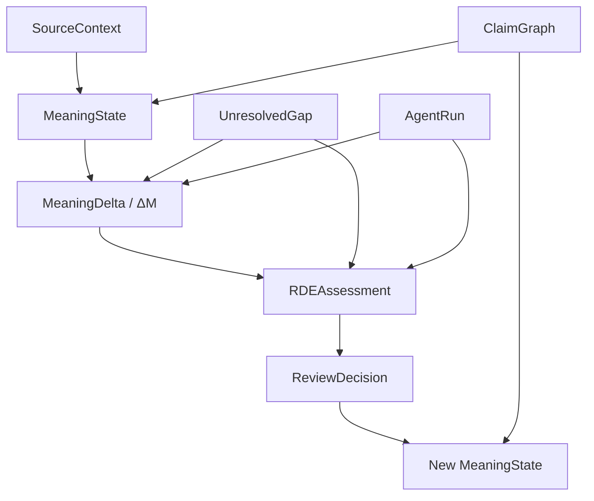
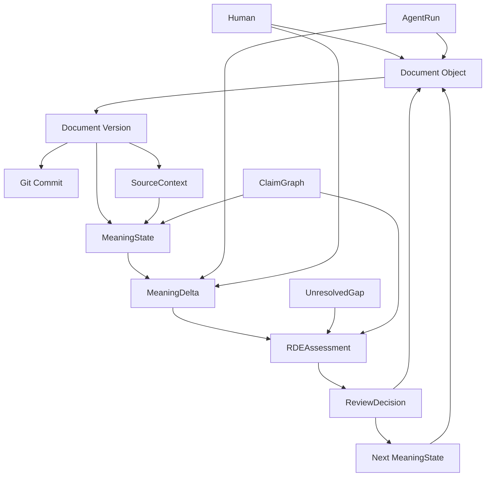

---

title: "🛠️ Kotonoha構想：意味履歴を管理するSemantic Lineage System"
created: 2026-05-17T00:00:00+09:00
updated: 2026-05-20T00:00:00+09:00
author: "Tomoyuki Kano [tomyuk@zyxcorp.jp](mailto:tomyuk@zyxcorp.jp)"
tags: [Kotonoha, SLS, RDE, MeaningDelta, SemanticLineage, Git, PostgreSQL, AI設計]
source_type: chatgpt
source_id: "kotonoha-semantic-lineage-concept"
document_type: concept_note
status: provisional-v0.1
version: "0.1-provisional"
links:

* [[RDE]]
* [[MeaningDelta]]
* [[Semantic Lineage System]]
* [[Kotonoha Minimal UI]]

---

# 🛠️ Kotonoha構想：意味履歴を管理するSemantic Lineage System

> **暫定版（provisional v0.1）** — 本書は Kotonoha 構想の**公開向け長文正本**（非規範）である。実装の適合・スキーマの正本は [`kotonoha-spec`](https://github.com/zyx-corporation/kotonoha-spec)。内部開発計画の正本参照は [`kotonoha-management` `27_kotonoha_concept_development_plan.md`](https://github.com/zyx-corporation/kotonoha-management/blob/main/docs/27_kotonoha_concept_development_plan.md)。短い要約は [`../concepts/kotonoha_concept_overview.md`](../concepts/kotonoha_concept_overview.md)。

## 目次

1. [中心命題](#1-中心命題)
2. [背景](#2-背景gitだけでは意味の履歴を扱えない)
3. [基本定義](#3-基本定義)（[コア型の暫定定義](#31-コア型の暫定定義m0)）
4. [基本データモデル](#4-基本データモデル)
5. [Document Object](#5-document-objectとの相互作用)
6. [Gitとの関係](#6-gitとの関係)
7. [Kotonoha Core](#7-kotonoha-core)
8. [最小CoreのDB方針](#8-最小coreのdb方針)
9. [RDEとの関係](#9-rdeとの関係)
10. [クライアント群](#10-クライアント群の位置づけ)
11. [MCP接続](#11-mcp接続)
12. [Kotonoha Minimal UI](#12-kotonoha-minimal-ui)
13. [設計原則](#13-車輪の再発明を避ける設計原則)
14. [開発方針](#14-開発方針)
15. [Phase 0](#15-phase-0概念仕様の固定) — [暫定版完了チェック](#暫定版v01-完了チェック本書時点)
16–21. [Phase 1〜5・Phase X](#16-phase-1kotonoha-core最小実装)
22. [マイルストーン](#22-マイルストーン一覧)
23. [v0.1 非対象](#23-v01の明確な非対象)
24. [Multimodal ΔM](#24-multimodal-meaningdeltaの位置づけ)
25. [RDE差異検証メモ](#25-rde差異検証メモ)
26. [要約](#26-要約)

---

## 1. 中心命題

Kotonohaは、文書・議論・設計・実装の変更履歴ではなく、その背後にある**意味変化 ΔM**と知的関係の系譜を記録・評価・再利用するためのSemantic Lineage Systemである。

Gitが「文字列とファイルの履歴」を扱うなら、Kotonohaは「意味状態と意味変化の履歴」を扱う。

したがって、Kotonohaの本質は、特定のエディタ、ノートアプリ、AIコーディングツールではない。それらを横断して、何が保存され、何が変換され、何が補完され、何が逸脱したのかを記録する基盤である。

最短定義は次の通りである。

**Kotonohaとは、Gitなどの内容履歴を物理的アンカーとして用いながら、文書・議論・設計・実装における意味状態と意味変化 ΔM を記録し、RDEによって監査可能にするSemantic Lineage Systemである。**

---

## 2. 背景：Gitだけでは意味の履歴を扱えない

現代の知的作業では、Git、Obsidian、Cursor、ChatGPT app、Claude Code、NotebookLMなどが組み合わされる。

それぞれは強力である。

Gitは差分を保存する。
Obsidianは知識のリンクを扱う。
Cursor / VSCodeは実装作業を支援する。
ChatGPT appは構想・批評・仕様化を支援する。
Claude Codeはコードベース単位の実装作業を担える。
NotebookLMは資料読解・要約・構造化に強い。

しかし、これらを組み合わせても、なお欠けているものがある。

それは、**意味がどのように変わったかの履歴**である。

たとえば、文章が書き換えられたとき、Gitは行差分を示せる。しかし、次のような問いには直接答えられない。

```text
- この変更で主張の射程は広がったのか
- 仮説が断定に変わっていないか
- 元の思想は保存されたのか
- 未解決点が消されていないか
- AIによる補完は正当な発展なのか、逸脱なのか
- 実装上の都合が理論的主張へすり替わっていないか
```

Kotonohaは、この欠落を埋めるための基盤である。

---

## 3. 基本定義

Kotonohaは、以下の主要オブジェクトを扱う。

```text
MeaningState
  ある時点における意味状態

MeaningDelta
  意味状態間の変化 ΔM

RDEAssessment
  意味変化に対するRDE評価

SourceContext
  参照元・議論・資料・会話・Issue

ClaimGraph
  主張・概念・根拠・依存関係

UnresolvedGap
  未解決点・判断保留・追加検証事項

ReviewDecision
  人間または制度的判断

AgentRun
  AIエージェントによる作業単位
```

Kotonohaが扱うのは、単なるファイルではなく、**意味を帯びた作業単位**である。

### 3.1 コア型の暫定定義（M0）

以下は **暫定版 v0.1** における概念レベルの定義である。PostgreSQL スキーマ・JSONB のフィールド名・適合キーワードは [`kotonoha-spec`](https://github.com/zyx-corporation/kotonoha-spec) および Core 実装 Issue で確定する。

| 型 | 暫定定義 | 主な識別・参照 |
| --- | --- | --- |
| **MeaningState** | ある時点における意味状態（主張・意図・制約・未解決点のスナップショット） | `meaning_state_id`、任意で `document_object_id` / `git_commit` |
| **MeaningDelta (ΔM)** | 意味状態間の変化。意図された変更・保存・変換・補完・未解決・逸脱リスクを記述する | `meaning_delta_id`、**必須アンカー:** `git_commit` / `file_path` / `line_range` または diff 参照 |
| **RDEAssessment** | MeaningDelta に対する RDE 評価結果（preserved / authorized transformation / inferred extension / unresolved gap / suspicious drift / critical distortion 等） | `rde_assessment_id`、JSONB 本体、監査相関 ID |
| **ReviewDecision** | 人間または制度的判断（approve / hold / reject / needs_revision 等）。RDE の代替ではない | `review_decision_id`、実行者・時刻・根拠参照 |

**境界:** `AgentRun`・`ClaimGraph`・`UnresolvedGap` は v0.1 でも参照するが、スキーマ詳細は Phase 1 以降の実装計画で段階的に固定する。

---

## 4. 基本データモデル

Kotonohaの中心線は次の通りである。

```text
SourceContext
  → MeaningState
  → MeaningDelta / ΔM
  → RDEAssessment
  → ReviewDecision
  → New MeaningState
```

この構造により、ある資料・会話・Issue・Git差分から意味状態が抽出され、その意味状態が改稿・生成・実装・レビューを通じて変化し、その変化がRDEにより評価され、人間または制度的判断によって採用・保留・差し戻しされる。



この図は、Kotonohaが単なる保存庫ではなく、**意味状態が変化し、その変化が評価され、再び意味状態として定着する循環システム**であることを示している。

---

## 5. Document Objectとの相互作用

Kotonohaでは、文書を単なるファイルではなく、知的作業の対象としての**Document Object**として扱う。

Document Objectには、論文草稿、仕様書、note記事、設計メモ、Issue下書き、実験記録などが含まれる。



この図の要点は、文書の物理的変更と意味的変更を分けることである。

```text
Document Object
  ↓
Document Version / Git Commit
  = 物理的・文字列的な履歴

MeaningState / MeaningDelta / RDEAssessment
  = 意味的・評価的な履歴
```

Gitは文書の版を固定し、Kotonohaはその版が何を意味していたかを記録する。

---

## 6. Gitとの関係

KotonohaはGitを置き換えない。

むしろ、Gitを物理的・文字列的な履歴のアンカーとして使う。

```text
Git
  = content lineage
  = ファイル・文字列・commit・branch・tag・mergeの履歴

Kotonoha DB
  = semantic lineage
  = 意味状態・意味変化・評価・未解決点・判断履歴の履歴
```

Gitのcommit hashは、Kotonoha DBにとって固定点になる。

```text
Git commit / diff / file path / line range
        ↓
Kotonoha MeaningDelta / RDEAssessment / ReviewDecision
```

一文で言えば、**Gitは文字列の時間軸を持ち、Kotonohaは意味の時間軸を持つ。**

---

## 7. Kotonoha Core

Kotonohaの本体は、特定のUIではなくCoreである。

```text
Kotonoha Core
  ├─ Semantic Lineage DB
  ├─ Git / Content Adapter
  ├─ MeaningDelta Engine
  ├─ RDE Engine
  ├─ Claim / Source Manager
  ├─ AgentRun Logger
  ├─ Workflow / Review Engine
  └─ MCP Gateway
```

Coreは、エディタ非依存、クライアント非依存である。

Obsidian、Cursor、VSCode、ChatGPT app、Claude Code、NotebookLMは、すべてKotonoha Coreに接続される外部クライアントまたはエージェントである。

---

## 8. 最小CoreのDB方針

Kotonohaの最小CoreにおけるDBは、PostgreSQLを前提とする。

SQLiteはローカル単体の試作には便利だが、Kotonohaでは最初から以下が重要になる。

```text
- 複数文書・複数commit間の意味履歴
- JSONBによる柔軟なRDE記録
- full-text search
- pgvector等による将来の意味検索
- transactionによる監査記録の一貫性
- GitHub / VSCode / ChatGPT app / Claude Code 等からの接続
- 将来のチーム利用
```

したがって、正式な最小Coreは次のように置く。

```text
Kotonoha Core v0.1
  ├─ PostgreSQL
  ├─ DB migration
  ├─ Git Adapter
  ├─ Document Object Registry
  ├─ MeaningState schema
  ├─ MeaningDelta schema
  ├─ RDEAssessment schema
  ├─ ReviewDecision schema
  ├─ AgentRun schema 最小版
  └─ CLI
```

PostgreSQLはPhase 1から採用し、将来的にチーム運用・Web Console・権限管理へ拡張する。

---

## 9. RDEとの関係

KotonohaはRDEを内包する。

RDE（Resonant Deviation Evaluator）は、生成物や改稿結果が元の意味状態からどう変化したかを評価する層である。

RDEは、単なる品質評価器ではない。評価対象は、次のような差異である。

```text
preserved
  保存された要素

authorized transformation
  許可された変換

inferred extension
  補完・推論された拡張

unresolved gap
  未解決のまま残した要素

suspicious drift
  疑わしい逸脱

critical distortion
  重大な歪曲
```

Kotonohaは、RDEが評価するための対象、履歴、文脈、再審可能性を保持する土台である。

言い換えると、**RDEが意味変化を裁定するなら、Kotonohaは意味変化を記憶する。**

---

## 10. クライアント群の位置づけ

Kotonohaは、特定のアプリケーションに閉じない。

### 10.1 ChatGPT app

ChatGPT appは、構想整理、論文・設計思想、RDE差異検証、仕様生成に向く。

```text
ChatGPT app
  → Meaning Design
  → RDE Discussion
  → Spec Draft
  → Kotonoha DBへ記録
```

ChatGPT appは、意味設計・意味評価ワークベンチとして位置づけられる。

### 10.2 Cursor / VSCode

Cursor / VSCodeは、実装、文書編集、リポジトリ内作業、Git diffとの接続に向く。

```text
Cursor / VSCode
  → File Edit
  → Git Diff
  → MeaningDelta Registration
  → RDE Panel
```

Cursorは必須要件ではなく、VSCode系クライアントの一つである。

### 10.3 Claude Code

Claude Codeは、コードベース読解、実装修正、テスト修正、PR単位の作業代行に向く。

```text
Kotonoha Spec
  → Claude Code AgentRun
  → Patch / Test Result
  → Git Diff
  → RDE Assessment
  → Human Review
```

Claude Codeは、Kotonohaの実装系エージェントとして有望である。ただし、Kotonoha Coreの意味履歴とRDE監査に従属する作業実行器として扱うべきである。

### 10.4 NotebookLM

NotebookLMは、資料読解、要約、FAQ、Mind Map、Audio Overviewなどに向く。

```text
Source Set
  → NotebookLM Interpretation
  → Derived Artifact
  → MeaningDelta
  → RDE Assessment
```

NotebookLMの出力は正解ではなく、Kotonoha上では意味変換ΔMの候補として扱われる。

### 10.5 Obsidian

Obsidianは、知識ノート、草稿、リンク構造、個人研究環境に向く。

ただし、KotonohaはObsidian pluginに閉じない。ObsidianはKotonoha Consoleの一候補である。

---

## 11. MCP接続

KotonohaはMCP接続によって、外部エージェント・外部知識処理器と接続できる。

ただし、MCPは「何でも自由につなぐ線」ではなく、capability制御された接続層として扱う。

```text
Kotonoha MCP Gateway
  ├─ read_source_set
  ├─ export_context_pack
  ├─ register_derived_artifact
  ├─ create_meaning_delta
  ├─ run_rde_assessment
  ├─ attach_human_review
  └─ export_report
```

NotebookLM、ChatGPT app、Claude Code、Cursorなどは、MCPまたは専用adapterを通じてKotonoha Coreに接続される。

重要なのは、外部ツールの出力を正解と見なさないことである。それらはすべて、Kotonoha上では意味変換ΔMの候補として扱われ、RDEと人間レビューの対象になる。

---

## 12. Kotonoha Minimal UI

VSCode pluginは、Obsidian/Cursorの代替ではなく、Kotonohaの最小基本UIになり得る。

最小UIの目的は、編集そのものではない。

```text
Diffを見るUIではない。
Diffに意味を与えるUIである。
```

または、次のように言える。

```text
編集するためのUIではない。
編集が何を変えたのかを記録するUIである。
```

Kotonoha Minimal UI v0.1は、次を扱う。

```text
Kotonoha Minimal UI
  ├─ Current Context
  │    ├─ repo
  │    ├─ branch
  │    ├─ file
  │    ├─ selection
  │    └─ git diff
  ├─ MeaningDelta Form
  │    ├─ intended change
  │    ├─ preserved elements
  │    ├─ transformed elements
  │    ├─ inferred extensions
  │    ├─ unresolved gaps
  │    └─ drift risks
  ├─ RDE Panel
  │    ├─ assessment result
  │    ├─ warning
  │    ├─ required human review
  │    └─ next action
  └─ Register / Link
       ├─ save to Kotonoha DB
       ├─ link to commit
       ├─ link to issue / PR
       └─ export report
```

このUIは、VSCode extensionとして先行実装する価値がある。

理由は、VSCode / Cursor圏ではGit diff、ファイル、選択範囲、branch、commit、テスト、Issue草稿が近くにあるためである。

---

## 13. 車輪の再発明を避ける設計原則

Kotonohaは、既存ツールを再実装しない。

再実装すべきでないものは次の通りである。

```text
- Obsidian的なノートアプリ全体
- Cursor的なAIコードエディタ
- NotebookLM的な資料読解UI
- GitHub的なIssue / PR管理
- Gitそのもの
- 汎用LLMチャットUI
```

Kotonohaが作るべきものは次の通りである。

```text
- 意味状態の記録
- 意味変化 ΔM の登録
- Git diff と意味差分の対応付け
- RDE評価の保存
- 未解決点の保持
- 人間レビューと判断履歴
- 外部エージェント出力の意味監査
```

つまり、**既存ツールが作業を行い、Kotonohaが意味の履歴を記録する。**

---

## 14. 開発方針

Kotonohaの開発は、最初から大規模な統合知識基盤を目指すのではなく、**意味履歴を記録・監査する最小構造**から開始する。

初期段階では、対象を主に以下に限定する。

```text
- Markdown / LaTeX / 設計文書
- Git管理されたファイル
- Git diff / commit
- MeaningState
- MeaningDelta
- RDEAssessment
- ReviewDecision
- 最小UI
```

開発原則は次の通りである。

```text
1. Core first
   UIや外部ツール連携より先に、Kotonoha Coreのデータモデルを確立する。

2. Git anchored
   Git commit / diff / file path / line rangeを意味履歴の物理アンカーとして利用する。

3. UI minimal
   最初のUIは、編集環境そのものではなく、差分に意味を与える最小UIとする。

4. Human-in-the-loop
   RDE評価は最終判断ではなく、人間レビューと再審可能性を前提とする。

5. Tool agnostic
   Obsidian、Cursor、VSCode、ChatGPT app、Claude Code、NotebookLMは交換可能なクライアントまたは外部エージェントとして扱う。
```

---

## 15. Phase 0：概念仕様の固定

### 目的

Kotonohaの中核概念を、実装可能な仕様へ落とし込む。

### 主な成果物

```text
- Kotonoha構想ドキュメント v0.1
- 用語定義
- 基本データモデル
- Document Object図解
- Git連携モデル
- RDEとの関係整理
- v0.1で扱わない範囲の明示
```

### 完了条件

```text
- MeaningState / MeaningDelta / RDEAssessment / ReviewDecisionの定義がある
- Document ObjectとGit Commitの関係が図示されている
- Kotonoha Coreと外部クライアントの境界が明確である
- マルチモーダルΔMが将来研究扱いとして分離されている
```

### 暫定版 v0.1 完了チェック（本書時点）

| 条件 | 本書での充足 |
| --- | --- |
| 四コア型の定義 | [§3.1](#31-コア型の暫定定義m0) |
| Document Object ↔ Git Commit | [§5](#5-document-objectとの相互作用)（Mermaid 図） |
| Core と外部クライアントの境界 | [§7](#7-kotonoha-core)、[§10](#10-クライアント群の位置づけ) |
| マルチモーダル ΔM の分離 | [§21](#21-phase-x将来研究)、[§24](#24-multimodal-meaningdeltaの位置づけ) |

**Phase 0（概念固定）の暫定版として本書を M0 成果物とみなす。** 次段階（M1）は PostgreSQL スキーマ・CLI・`kotonoha-core` 実装へ移る（[§16](#16-phase-1kotonoha-core最小実装)）。

---

## 16. Phase 1：Kotonoha Core最小実装

### 目的

Git差分に対してMeaningDeltaとRDE記録を付与できる最小バックエンドを作る。

### 主な実装対象

```text
Kotonoha Core v0.1
  ├─ PostgreSQL
  ├─ DB migration
  ├─ Git Adapter
  ├─ Document Object Registry
  ├─ MeaningState schema
  ├─ MeaningDelta schema
  ├─ RDEAssessment schema
  ├─ ReviewDecision schema
  ├─ AgentRun schema 最小版
  └─ CLI
```

### 優先機能

```text
- kotonoha init
- kotonoha status
- kotonoha diff
- kotonoha delta create
- kotonoha rde attach
- kotonoha review approve / hold / reject
- kotonoha export
```

### 完了条件

```text
- PostgreSQL上に基本スキーマを作成できる
- Git管理下の文書に対してMeaningDeltaを作成できる
- MeaningDeltaがcommit hash / file path / line rangeに紐づく
- RDEAssessmentをJSONBとして保存できる
- ReviewDecisionを記録できる
- CLIから一連の操作が可能である
```

---

## 17. Phase 2：Kotonoha Minimal UI

### 目的

VSCode / Cursor系環境で、Git差分に意味を付与する最小UIを提供する。

### 位置づけ

Kotonoha Minimal UIは、ObsidianやCursorの代替ではない。それは、差分を意味変化として登録し、RDE評価と人間レビューを結びつけるための最小作業面である。

### 主な機能

```text
Kotonoha Minimal UI
  ├─ Current Context 表示
  │    ├─ repository
  │    ├─ branch
  │    ├─ file
  │    ├─ selection
  │    └─ git diff
  ├─ MeaningDelta 入力
  │    ├─ intended change
  │    ├─ preserved elements
  │    ├─ transformed elements
  │    ├─ inferred extensions
  │    ├─ unresolved gaps
  │    └─ drift risks
  ├─ RDE Panel
  │    ├─ assessment result
  │    ├─ warnings
  │    ├─ human review required
  │    └─ next action
  └─ Register / Link
       ├─ save to Kotonoha DB
       ├─ link to commit
       ├─ link to issue / PR
       └─ export report
```

### 完了条件

```text
- VSCode上で現在のGit差分を取得できる
- 選択範囲またはdiff単位でMeaningDeltaを登録できる
- RDEAssessmentを表示できる
- ReviewDecisionをUIから記録できる
- Kotonoha Coreと通信できる
```

---

## 18. Phase 3：GitHub / Issue / PR連携

### 目的

意味履歴を、GitHub上のIssue、Pull Request、Review Commentと接続する。

### 主な機能

```text
- IssueとMeaningDeltaの紐づけ
- PR diffとRDEAssessmentの紐づけ
- PR説明文へのRDEサマリー出力
- ReviewDecisionのGitHub comment反映
- semantic checkのCI連携
```

### 完了条件

```text
- PR単位でMeaningDeltaを一覧できる
- RDE評価結果をPRレビューに添付できる
- 未解決点がIssueとして再登録できる
- CI上で最低限のsemantic checkが実行できる
```

---

## 19. Phase 4：外部エージェント連携

### 目的

ChatGPT app、Claude Code、NotebookLM、Obsidianなどの外部ツールを、Kotonoha Coreに接続する。

### 主要連携

```text
ChatGPT app
  - 構想整理
  - 仕様生成
  - RDE差異検証
  - MeaningDelta草案生成

Claude Code
  - 実装作業
  - テスト修正
  - patch生成
  - AgentRun記録

NotebookLM
  - Source Set読解
  - 要約
  - FAQ
  - Mind Map
  - 派生Artifact登録

Obsidian
  - 研究ノート
  - 草稿管理
  - 文書リンク
  - Kotonoha Console候補
```

### 必要となる構成

```text
- AgentRun schema
- Context Pack export
- Derived Artifact registry
- MCP Gatewayまたは専用Adapter
- capability制御
- audit log
```

### 完了条件

```text
- 外部エージェントの出力をAgentRunとして記録できる
- AgentRunからMeaningDeltaを生成できる
- 外部出力をRDEAssessment対象として扱える
- 直接commit/pushなどの危険操作を制限できる
```

---

## 20. Phase 5：チーム利用・制度化

### 目的

個人研究環境から、チーム・組織で利用できる意味履歴基盤へ拡張する。

### 主な機能

```text
- PostgreSQLのマルチユーザー運用
- Web Console
- Team / Organization workspace
- RBAC / capability security
- audit log hardening
- review workflow
- project-level semantic lineage
- report export
```

### 完了条件

```text
- 複数ユーザーでMeaningDeltaを共有できる
- ReviewDecisionに権限管理を適用できる
- Project単位で意味履歴を追跡できる
- 外部監査向けレポートを出力できる
```

---

## 21. Phase X：将来研究

以下は、Kotonoha v0.1の中核実装には含めない。ただし、Kotonohaが意味変化一般の基盤へ拡張される可能性として、研究ノートに保持する。

```text
- Multimodal MeaningDelta
- 画像へのΔM評価
- 音声・音楽へのΔM評価
- 動画編集における意味変化監査
- Temporal / Affective / Cross-modal Alignment軸
- drift subtypeの拡張
- Counterfactual replay
- 高度なClaimGraph
- 自動mergeではなく意味再審としての統合
```

これらは、実装済み能力として記述しない。あくまで、将来研究・将来実装の射程として扱う。

---

## 22. マイルストーン一覧

```text
M0: Concept Freeze
  Kotonoha構想、用語、基本データモデル、対象範囲を固定する。

M1: Core Prototype
  PostgreSQL + Git Adapter + MeaningDelta schema + CLIを実装する。

M2: RDE Record Integration
  RDEAssessment / ReviewDecisionをMeaningDeltaに紐づける。
  RDEAssessmentはJSONBとして保持し、後続のschema evolutionに耐える構造にする。

M3: Minimal UI Prototype
  VSCode extensionとして、Git diffとMeaningDelta登録UIを実装する。

M4: GitHub Integration
  Issue / PR / Review Commentと意味履歴を接続する。

M5: AgentRun Integration
  ChatGPT app / Claude Code / NotebookLMなどの外部出力を記録可能にする。

M6: Team Mode
  PostgreSQLのマルチユーザー運用 / Web Console / 権限管理 / 監査ログを実装する。

MX: Multimodal Research Note
  画像・音声・音楽・動画へのΔM拡張を研究ノートとして整理する。
```

---

## 23. v0.1の明確な非対象

v0.1では、以下を実装対象外とする。

```text
- Obsidian全体の再実装
- Cursor的AIコードエディタの再実装
- NotebookLM的資料読解UIの再実装
- 完全自動RDE判定
- 完全自動merge
- マルチモーダルΔM評価
- 組織向け高度権限管理
- 大規模Graph DB
- 文書生成AIそのもの
```

これは縮小ではなく、設計上の節制である。

Kotonoha v0.1がまず実証すべきことは、ただ一つである。

**Git差分に対して、意味変化 ΔM とRDE評価を記録できるか。**

ここが成立すれば、Kotonohaの基礎は成立する。ここが曖昧なまま外部連携やUIを拡張すると、単なるAIツール統合基盤に流れてしまう。

---

## 24. Multimodal MeaningDeltaの位置づけ

画像・音声・音楽・動画へのΔM評価は、現時点ではKotonoha v0.1の実装対象ではなく、将来的可能性の方向として提示する。

意味変化ΔMは本質的にはテキストに限定されない。画像、音声、音楽、動画においても、編集・要約・変換・生成によって意味の保存、変形、補完、逸脱が発生する。

ただし、既存の画像類似度、音響品質、動画一貫性評価をそのままΔM評価と呼ぶべきではない。それらは下位特徴量であり、RDEが扱うべきなのは、より上位の意味変化である。

```text
- 何が保存されたか
- 何が変換されたか
- 何が補完されたか
- 何が省略されたか
- 何が別の意味へ滑ったか
- その変化は意図されたものか
- 責任・価値・文脈の配置は変わったか
```

将来的なMultimodal ΔM評価では、RDEの基本6分類を上位判定カテゴリとして維持しつつ、知覚、対象、行為、時間、感情、様式、文化的象徴、制度的文脈、モダリティ間整合性といった補助評価軸を導入する。

```text
Multimodal ΔM Evaluation Axes

1. Perceptual Axis
   知覚的変化

2. Object / Entity Axis
   対象・人物・物体・主体の変化

3. Action / Event Axis
   行為・出来事・因果関係の変化

4. Temporal Axis
   時間順序・継続性・編集構造の変化

5. Affective / Tonal Axis
   感情・声色・演出トーン・雰囲気の変化

6. Stylistic / Genre Axis
   様式・ジャンル・表現形式の変化

7. Symbolic / Cultural Axis
   象徴・文化的文脈・記号的意味の変化

8. Contextual / Institutional Axis
   報道性・証拠性・責任配置・制度的意味の変化

9. Cross-modal Alignment Axis
   映像・音声・字幕・音楽・テキスト間の整合性変化
```

ただし、この議論は本文中核ではなく、研究ノートまたは将来展望ノートとして保持する。

---

## 25. RDE差異検証メモ

### 保存された要素

Kotonohaが意味変化の履歴を管理する基盤であるという中核は保存されている。

### 変換された要素

当初のObsidian / Cursor中心の作業環境観から、エディタ非依存のSemantic Lineage Coreとして再定義された。

### 補完された要素

Git連携DB、Document Object、MeaningState、MeaningDelta、RDEAssessment、ReviewDecision、AgentRun、MCP Gateway、Minimal UI、PostgreSQL前提が補完された。

### 未解決の要素

PostgreSQLスキーマの詳細、RDEAssessmentのJSONB構造、VSCode extensionのUI仕様、GitHub連携API、AgentRunログ形式、権限モデルは未解決である。

### 逸脱リスク

Kotonohaが、AIエディタ、Obsidianプラグイン、NotebookLM代替、Git拡張のいずれかに矮小化されるリスクがある。

また、Multimodal ΔMや完全自動RDE評価など、将来研究段階の内容を実装済み能力のように見せてしまうリスクがある。

### 次回更新方針

1. **M1:** PostgreSQL スキーマ草案・migration・`kotonoha delta create` 等 CLI を `kotonoha-core` / `kotonoha-cli` で起票・実装する。
2. **仕様:** 四コア型の normative 最小表現を `kotonoha-spec` へエスカレーションするか、本書からの要約リンクに留めるかを Issue で決める。
3. **派生:** `kotonoha_concept.tex` / PDF との差分を整理し、必要なら LaTeX 側を暫定版に追随させる。

---

## 26. 要約

Kotonohaは、Gitなどの内容履歴を物理的アンカーとして用いながら、文書・議論・設計・実装における意味状態と意味変化ΔMを記録し、RDEによって監査可能にするSemantic Lineage Systemである。

Obsidian、Cursor、VSCode、ChatGPT app、Claude Code、NotebookLMは、Kotonohaの本体ではない。それらはすべて、Kotonoha Coreに接続されるクライアントまたは外部エージェントである。

Kotonoha v0.1がまず実証すべきことは、Git差分に対して、MeaningDeltaとRDEAssessmentをPostgreSQL上に記録できるかである。

この最小Coreが成立すれば、Kotonohaは単なる文書管理でも、AI編集支援でもなく、生成AI時代における意味の来歴管理基盤として成立する。
